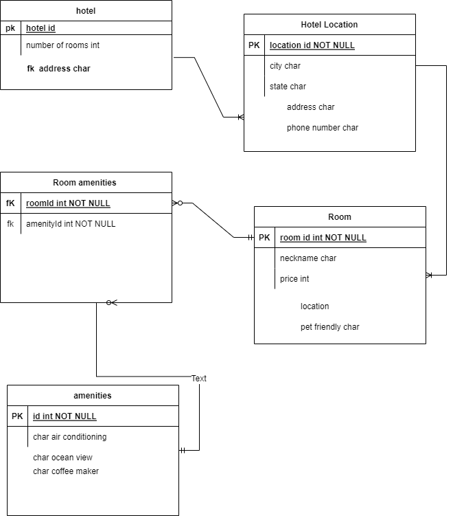

# Async-Inn
- Async-Inn project
- Bashar Owainat
- Apr 14th 2022

## my model

hotel table:
- has hotel id as a primary key
- has number of rooms in the hotel
- has a  an address as a foregin key from hotel location table

hotel location table:
- has locatio id a primary key
- has city, state, address and phone number

Room amenities table:
- has roomid as fk
- has amenityid as fk
- the pk is both roomid and amenityid

amenities table:
- has the amenities air conditioning, ocean view, coffe makerand room number

room table:
- has roomid as a pk
- has neckname, price, pet friendly and location

### the relations

- one hotel can have many locations
- one location has many rooms
- many rooms can have many amenities

